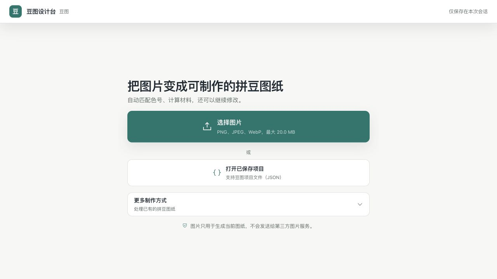
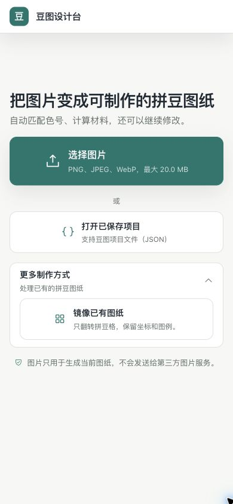

# 豆图设计台中国普通顾客体验与功能审计

- 审计日期：2026-07-28（America/Los_Angeles）
- 审计类型：UX、可访问性风险、响应式、功能逻辑与运行态联合审计
- 目标顾客：中国普通拼豆顾客，默认不理解图像格式、色彩算法或项目内部术语
- 审计对象：当前仓库 `HEAD 08c980d`、当前运行实例 `127.0.0.1:8000`
- 审计性质：只读；未修改产品代码或运行服务

## 结论

当前产品的核心设计方向正确，开始页符合普通顾客的任务心智：只有一个主入口，“打开项目”和“镜像已有图纸”被合理降级；中文文案清楚，移动端无横向溢出，主要操作尺寸合格，自动化逻辑覆盖也很强。

但本轮不能给出“所有功能逻辑都正确、可以完美使用”的结论，当前状态应判定为 **有条件不通过**：

1. 当前正在运行的后端早于最新代码启动，实际只支持两种 PNG 模板；“色号图纸”和“圆角方格”请求返回 422。
2. 前端总质量门禁失败：图标生成物漂移，三个预览操作图标缺少 CSS 映射；另有三个文件未通过格式检查。
3. 唯一权威产品规范内部同时规定“两种”和“四种”PNG 模板，验收标准自相矛盾。
4. 主要上传说明文字只有约 12 px，实际对比度约 3.87:1，低于普通小字号文字建议的 4.5:1。
5. 浏览器插件未获本地文件访问权限，无法在本轮用真实文件走完上传后的可视化端到端流程；后续编辑、导出界面和已有图纸流程只有代码、接口和自动化测试证据，不能冒充完整人工验收。

## 流程截图与步骤健康度

### 步骤 1：桌面开始页

健康度：良好。

- 主标题直接描述结果，“选择图片”是唯一高强调操作。
- “打开已保存项目”为次级入口，“更多制作方式”默认折叠，符合新顾客优先心智。
- 隐私提示可见，页面没有营销噪声或内部技术术语。
- 桌面留白较多，但主操作仍居中、完整、易扫描。

### 步骤 2：390 × 844 移动开始页

健康度：良好，存在小字号与对比度问题。

- 首屏内完整显示主标题、上传、项目导入、更多方式和隐私提示。
- 390 px 下没有横向溢出，主操作触控面积明显大于 44 × 44 CSS px。
- 顶部留白较大，但不妨碍主任务出现在首屏。
- “PNG、JPEG、WebP，最大 20.0 MB”为约 12.16 px 小字，且在主色背景上的实测对比度约 3.87:1。

### 步骤 3：展开“更多制作方式”

健康度：良好。

- “镜像已有图纸”被放在渐进披露中，不会要求普通顾客在上传前先理解模式。
- 辅助说明“只翻转拼豆格，保留坐标和图例”比单独使用“镜像”更易理解。
- 折叠状态和展开状态均清楚，控件尺寸合格。

## 优点

1. **任务入口符合普通顾客偏好**：先选图，系统自动推荐；没有在第一屏强迫用户选择照片、像素画或专业参数。
2. **中文产品语言总体自然**：使用“图案大小、颜色数量、效果风格、拼豆品牌、完成并导出”等顾客术语，自动化测试还覆盖了内部术语负向扫描。
3. **渐进披露正确**：已有图纸镜像和专业设置不抢占主流程。
4. **响应式起点稳定**：320、375、390、430、768、1024、1440 px 七组视口均无页面横向溢出。
5. **键盘起点可用**：页面加载后焦点进入主工作区；Tab 可依次到图片输入、项目输入和更多方式；上传标签出现 2 px 可见焦点环。
6. **实现防回归能力强**：前端 274 项测试、后端 102 项测试通过；类型检查、ESLint 和生产构建通过。
7. **核心接口合同扎实**：生成结果统计一致；去背景返回 PNG、`Cache-Control: no-store`；当前源码的四种 PNG 模板均能成功导出。

## 重点问题

### P1：当前运行实例与最新源码不一致

证据：

- 当前 `8000` 服务启动时间：2026-07-28 03:11:53。
- 当前 `HEAD` 提交时间：2026-07-28 18:14:41。
- 当前运行实例 `/api/capabilities` 只返回 `pure`、`annotated`。
- 当前运行实例导出结果：
  - `pure`：200
  - `annotated`：200
  - `numbered`：422
  - `rounded`：422
- 使用当前源码临时启动的独立验证实例返回四种模板，四种导出均为 200。

影响：

- 当前实际产品会禁用或拒绝“色号图纸”和“圆角方格”，与界面、测试和最新产品规范不一致。
- 顾客会遇到“功能看似存在但不能用”的可信度问题。

建议：

1. 更新代码后必须重启统一服务。
2. 在本地验收脚本中加入“运行中 capabilities 必须等于源码合同”的启动后检查。
3. 将四种 PNG 导出真实请求加入每次交付前的运行态 smoke test。

### P1：唯一产品规范内部冲突

证据：

- `docs/PRODUCT_SPEC.zh-CN.md:793` 和 `:800` 规定 PNG 只有“纯图案 / 带标注”。
- 同文件 `:1092` 规定 PNG 有“纯图案、带标注、色号图纸、圆角方格”四种模板。
- 当前代码、后端模型和测试实现的是四种模板。

影响：

- 同一个“唯一权威”无法作为验收真相。
- 后续维护者可能按旧章节删除新模板，或写出彼此矛盾的测试。

建议：

- 把第 12 章同步为四种模板，并为 `numbered`、`rounded` 增加与已有两种同级的规范说明。

### P1：总质量门禁失败

证据：

- `pnpm run check` 在 `check:icons` 失败。
- 重新生成后的差异显示当前 `src/generated/phosphor-icons.css` 缺少：
  - `.ph-crop`
  - `.ph-image`
  - `.ph-person-simple-circle`
- 这三个图标分别用于“调整原图”“更换图片”“一键去背景”。
- `pnpm run format:check` 还报告：
  - `pnpm-lock.yaml`
  - `src/features/pattern-editor/canvasEditor.ts`
  - `src/features/prepare-workspace/availableColorDialog.ts`

影响：

- 三个预览操作在当前构建中没有对应图标字形；文字仍可操作，但识别速度和视觉完整性下降。
- 仓库总门禁红灯，不能称为可交付状态。

建议：

- 重新生成图标 CSS，格式化报告的三个文件，然后重新执行完整 `pnpm run check`。

### P2：上传辅助文字不满足普通小字号对比度

证据：

- 主上传按钮说明文字约 12.16 px。
- 颜色为 76% 白色叠加在 `#0F766E` 上，计算对比度约 3.87:1。
- 普通小字号文字建议至少 4.5:1。
- 多处次级辅助文字约 11.84 px；这些文字对比度合格，但对中老年顾客仍偏小。

影响：

- 对低视力、屏幕亮度较低或户外使用者不友好。
- 中文小字号比拉丁字符更依赖清楚的笔画和字面尺寸。

建议：

- 主上传说明提高到至少 14 px，并把白色不透明度提高到可达到 4.5:1。
- 普通顾客路径中的关键辅助文字尽量不低于 13–14 px。
- 修复后用实际截图和自动对比度检查复验。

### P2：普通顾客仍需理解文件格式

当前主入口直接显示“PNG、JPEG、WebP”。这对熟悉文件的人准确，但对普通手机顾客不是任务语言。

建议文案方向：

- 主文案：“支持手机照片和常见图片，最大 20 MB”
- 更详细格式可放在文件选择失败提示、帮助信息或辅助说明中。

此项是优化建议，不是功能阻断。

## 功能逻辑验证

| 验证面                | 结果     | 证据                                                 |
| --------------------- | -------- | ---------------------------------------------------- |
| 前端自动化            | 通过     | 274 / 274                                            |
| 后端自动化            | 通过     | 102 / 102                                            |
| TypeScript            | 通过     | `pnpm run typecheck`                                 |
| ESLint                | 通过     | `pnpm run lint`                                      |
| 生产构建              | 通过     | Vite 203 modules，构建成功                           |
| 设计令牌              | 通过     | 74 tokens，无漂移                                    |
| 品牌配置              | 通过     | “豆图设计台”，无漂移                                 |
| 色板资产              | 通过     | 默认 39 色、MARD 221 色                              |
| 图标生成物            | 失败     | 缺少 3 个图标规则                                    |
| 格式检查              | 失败     | 3 个文件                                             |
| 完整 `pnpm run check` | 失败     | 被图标漂移阻断                                       |
| 真实生成接口          | 通过     | 48 × 22，共 1056 格；统计总数一致                    |
| 真实去背景接口        | 通过     | 200、PNG、291675 bytes、`no-store`                   |
| 当前运行实例四种 PNG  | 部分失败 | 新增两种返回 422                                     |
| 当前源码四种 PNG      | 通过     | 四种均返回 200                                       |
| 编辑器逻辑基准        | 通过     | 300 × 300 遍历 p95 约 0.928 ms；事务 p95 约 0.051 ms |
| 浏览器控制台          | 通过     | 当前已访问流程无 warning / error                     |
| 多视口开始页          | 通过     | 320–1440 px 无页面横向溢出                           |
| 键盘开始流程          | 通过     | 输入和 disclosure 可达，焦点环可见                   |

## 证据限制

以下项目本轮没有足够证据，不能宣称已完成人工端到端验收：

1. 浏览器文件上传被 Chrome 扩展的本地文件访问权限阻塞。
2. 因此没有在当前轮次用真实文件逐屏捕获：
   - 照片上传到首个自动预览
   - 像素画自动推荐
   - 项目 JSON 导入和继续编辑
   - 已有图纸检测、确认、水平/垂直镜像
   - 裁剪、旋转、去背景、恢复原图
   - 普通设置、专业设置、颜色 Dialog
   - Canvas 编辑、选择、撤销/重做、正反面
   - 移动 sheet 三态和桌面 inspector
   - 四个导出任务的真实下载 UI
3. 未做物理 iPhone 安全区、软键盘动画和触控手感测试。
4. 未用真实屏幕阅读器执行完整流程；截图和 DOM 只能说明风险，不能证明 WCAG 全面合规。
5. 未做 PDF 实体打印样张。
6. 未进行真实中国顾客访谈或可用性测试；“普通顾客偏好”结论来自启发式审计、产品文案和交互证据。

要解除浏览器上传阻塞，需要在 Chrome 的扩展详情中为 ChatGPT Chrome Extension 启用 “Allow access to file URLs”，然后重新跑一轮真实文件端到端截图验收。

## 建议执行顺序

1. P1：重启当前统一服务并复验 `/api/capabilities` 和四种 PNG 导出。
2. P1：统一产品规范中的 PNG 模板数量。
3. P1：修复图标生成物和格式检查，确保完整 `pnpm run check` 通过。
4. P2：提高上传说明文字字号与对比度。
5. 启用浏览器本地文件权限后，按产品规范第 20 章完成真实照片、像素画、项目 JSON、已有图纸、编辑和四类导出的全流程人工复验。
6. 最后补做物理 iPhone、屏幕阅读器和 PDF 打印样张。

## 检查的主要文件

- `README.md`
- `docs/PRODUCT_SPEC.zh-CN.md`
- `design-qa.md`
- `package.json`
- `scripts/start-local.sh`
- `scripts/generate-icon-styles.mjs`
- `src/app.ts`
- `src/main.ts`
- `src/styles/base.css`
- `src/styles/page.css`
- `src/styles/vaadin-theme.css`
- `src/features/start-workspace/startWorkspace.ts`
- `src/features/preview-workspace/previewWorkspace.ts`
- `src/features/app-capabilities/capabilities.ts`
- `src/features/export-completion/exportState.ts`
- `src/features/export-completion/exportCoordinator.ts`
- `src/features/prepare-workspace/prepareWorkspace.ts`
- `src/features/pattern-editor/canvasEditor.ts`
- `backend/app/main.py`
- `backend/app/limits.py`
- `backend/app/models.py`
- `backend/app/pattern_export.py`
- 前端 `tests/*.test.ts`
- 后端 `backend/tests/*.py`
